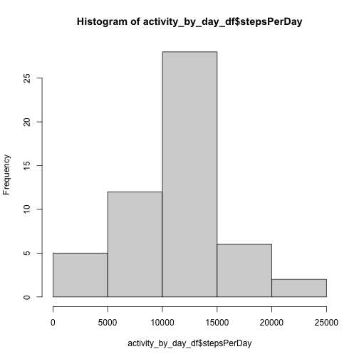
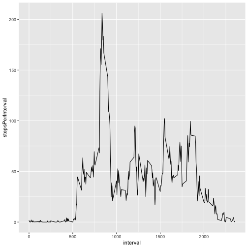
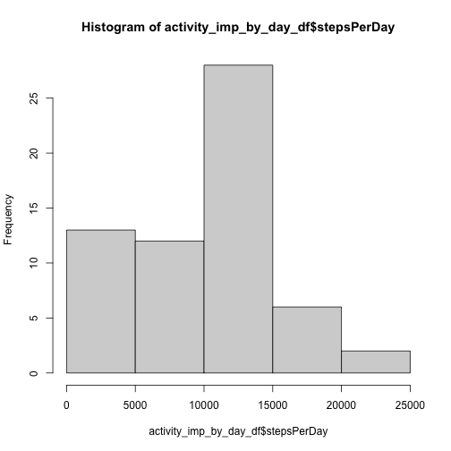
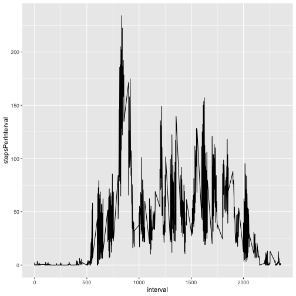

```r
library(dplyr)
library(ggplot2)
library(lubridate)
```

## Loading and preprocessing the data

```r
activity_df <- read.csv("activity.csv")
```

# What is mean total number of steps taken per day?

```r
activity_by_day_df <- activity_df %>% group_by(date) %>% summarize(stepsPerDay=sum(steps))

hist(activity_by_day_df$stepsPerDay)
```



```r
sprintf("Total number of steps per day: %s (Mean) %s (Median)",
        format(round(mean(activity_by_day_df$stepsPerDay, na.rm=TRUE)), big.mark = ","),
        median(activity_by_day_df$stepsPerDay, na.rm=TRUE))
```

```
## [1] "Total number of steps per day: 10,766 (Mean) 10765 (Median)"
```


## What is the average daily activity pattern?

```r
activity_by_interval_df <- activity_df %>% 
                           group_by(interval) %>% 
                           summarize(stepsPerInterval=mean(steps, na.rm=TRUE))

g <- ggplot(activity_by_interval_df, aes(x=interval, y=stepsPerInterval))
g + geom_line()
```



```r
sprintf("Interval with max avg # of steps: %s", 
        activity_by_interval_df[which.max(activity_by_interval_df$stepsPerInterval),]$interval)
```

```
## [1] "Interval with max avg # of steps: 835"
```


## Imputing missing values

```r
sprintf("Number of rows with NAs: %s", sum(rowSums(is.na(activity_df))))
```

```
## [1] "Number of rows with NAs: 2304"
```

```r
activity_imp_df <- activity_df
activity_imp_df$steps <- replace(activity_imp_df$steps,
                                 is.na(activity_imp_df$steps),
                                 tapply(activity_imp_df$steps,
                                        activity_imp_df$interval, median, na.rm=TRUE))

activity_imp_by_day_df <- activity_imp_df %>% group_by(date) %>% summarize(stepsPerDay=sum(steps))

hist(activity_imp_by_day_df$stepsPerDay)
```



```r
sprintf("Total number of steps per day: %s (Mean) %s (Median)",
        format(round(mean(activity_imp_by_day_df$stepsPerDay, na.rm=TRUE)), big.mark = ","),
        median(activity_imp_by_day_df$stepsPerDay, na.rm=TRUE))
```

```
## [1] "Total number of steps per day: 9,504 (Mean) 10395 (Median)"
```


## Are there differences in activity patterns between weekdays and weekends?

```r
dayType <- function(d){
  ifelse(startsWith(as.character(wday(d, label=TRUE)), "S"), "weekend", "weekday")
}

activity_df$dayType <- factor(dayType(activity_df$date))

activity_by_interval_df <- activity_df %>% 
                           group_by(interval, dayType) %>% 
                           summarize(stepsPerInterval=mean(steps, na.rm=TRUE))
```

```
## `summarise()` has grouped output by 'interval'. You can override using the `.groups` argument.
```

```r
g <- ggplot(activity_by_interval_df, aes(x=interval, y=stepsPerInterval))
g + geom_line()
```


